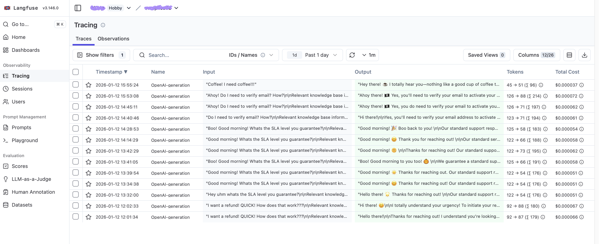

## LLM observability demo: a customer support draft assistant with tracing

A minimal FastAPI app that generates draft replies for support agents and logs the full LLM workflow to Langfuse.

The app retrieves relevant context from a local knowledge base (scikit-learn) and calls the OpenAI API to produce a grounded draft response.

Tech: Python, FastAPI, scikit-learn, OpenAI API, Langfuse.


---


## What's inside

The `app/` contains a FastAPI endpoint that:
- takes a support ticket, 
- optionally retrieves a few KB snippets, 
- calls an LLM, 
- and returns a draft


The `data/kb/` is the knowledge base (sample .md files) to use for model grounding.

---


## Resulting Langfuse dashboard ("Tracing")

showing a list of traces the app produces when the `/draft-reply` endpoint is invoked:



---


### How to run this

1. Create and activate a virtual environment:
   ```bash
   python3 -m venv venv
   source venv/bin/activate
   ```

2. Install dependencies:
   ```bash
   pip install -r requirements.txt
   ```

3. Set up environment variables:
   Create a `.env` file in the project root with the required keys:

   ```
   OPENAI_API_KEY=your_openai_api_key_here

   LANGFUSE_SECRET_KEY=your_langfuse_secret_key_here
   LANGFUSE_PUBLIC_KEY=your_langfuse_public_key_here
   LANGFUSE_BASE_URL=your_langfuse_base_url_here

   ENV=dev
   ```
   The `ENV` value can be anything (for example, `dev`).

4. Run the FastAPI app:
   ```bash
   uvicorn app.main:app --reload
   ```

5. The API will be available at `http://localhost:8000`
   - Health check: `GET http://localhost:8000/health`
   - API docs: `http://localhost:8000/docs`


### How retrieval works
1. Precompute an index from `data/kb/*.md` using TF-IDF vectorization.
2. Retrieval returns top 3 snippets by similarity.
3. Inject snippets into the prompt and return them as citations.

#### About TF-IDF

TF-IDF turns each document into a vector of word scores: terms that appear often in a document but less often across the whole set get higher weight. That makes common filler words less important and helps similarity search focus on the most distinctive terms. It is easier to use for PoCs like this one.

Implementation lives in `app/retrieval.py`, in the TF-IDF index builder and retrieval helpers (see `build_tfidf_index`). Can be safely ignored for the Langfuse demo purposes.
